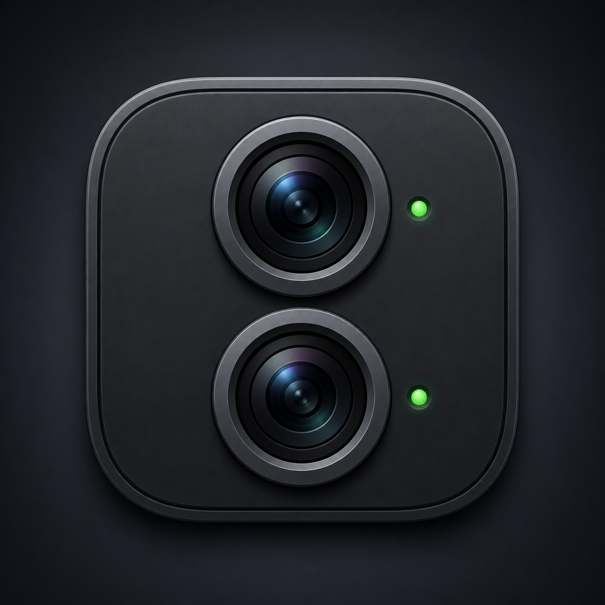
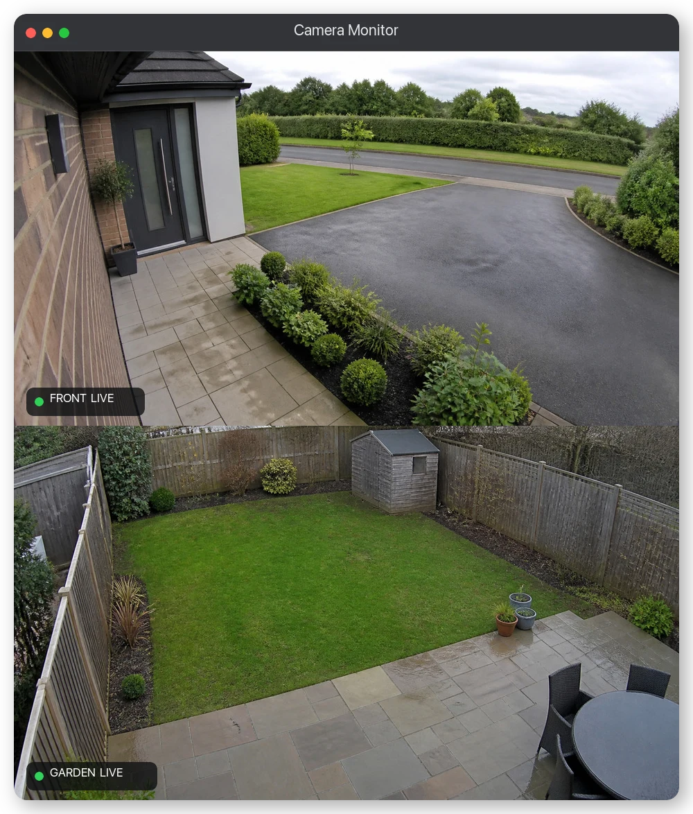
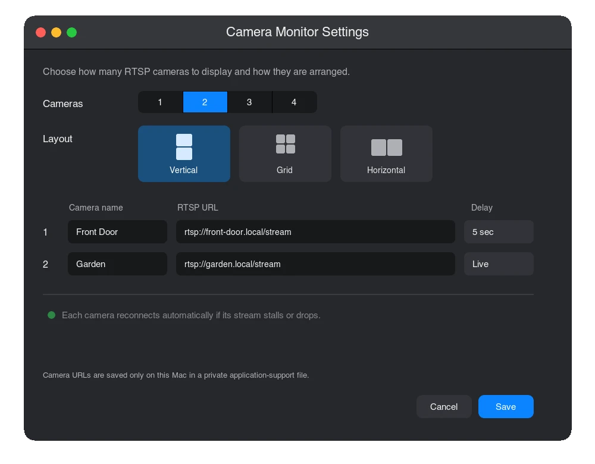

# Camera Monitor

A small native macOS viewer for one to four RTSP cameras. Camera Monitor keeps
one persistent window open, reconnects failed or stalled streams indefinitely,
and does not require a browser, VLC, an NVR, or a relay server.

<p align="center">
  
</p>

<p align="center">
  <strong><a href="https://github.com/umarsa/camera-monitor/releases/latest/download/CameraMonitor-Apple-Silicon.zip">Download Camera Monitor for Apple Silicon</a></strong>
</p>

Requires macOS 13 or later. The download is not signed with an Apple Developer
ID or notarized, so follow the [first-launch instructions](#installing-the-unsigned-app).

<p align="center">
  
</p>

<p align="center"><sub>Synthetic example feeds. No real property or camera details are shown.</sub></p>

## Features

- One to four named RTSP or RTSPS cameras.
- Per-camera Live, 2, 5, 10, 15, or 30-second viewing delays.
- Vertical, horizontal, and compact grid layouts.
- Clickable layout previews in a native macOS Settings window.
- A fixed window aspect ratio that keeps every camera cell at 16:9.
- Independent RTSP-over-TCP connections and reconnect loops.
- Three-second visual stall indication and a five-second decoded-frame
  watchdog that forces a clean reconnect.
- Compressed-packet time-shift buffers for smooth delayed viewing without the
  memory cost of retaining raw video frames.
- Latest-frame-only rendering after decoding to prevent unintended latency.
- VideoToolbox hardware decoding when supported by FFmpeg.
- Per-camera zoom up to 8x: scroll or pinch over a cell to zoom at the cursor,
  drag to pan, double-click to reset. A zoomed cell shows a minimap of the full
  frame and snaps back after 30 seconds unless you click its lock button.
- Remembered window position, size, and Always on Top state.
- A single-instance lock, so opening the app twice cannot duplicate streams.
- No recording, analytics, cloud service, or external network dependency.

## Configure cameras

Open **Camera Monitor > Settings…** or press `Command-,`.

Choose one to four cameras, enter a display name and complete RTSP URL for each,
select an optional delay, then choose Vertical, Grid, or Horizontal. Saving
applies the new configuration immediately and adjusts the main window to the
selected layout.

A delayed camera first shows yellow `BUFFERING` while its time-shift buffer
fills. It then turns green and includes the selected delay in its on-video
status. The buffer holds compressed camera packets, so a five-second delay is
typically only a few megabytes per camera rather than hundreds of megabytes of
decoded frames.

On first launch, the Settings window opens automatically.

<p align="center">
  
</p>

Settings are stored at:

```text
~/Library/Application Support/Camera Monitor/settings.conf
```

The file is created with mode 600. Names and URLs are Base64-encoded to make
the line-oriented file robust, not to claim encryption. Because RTSP URLs may
contain passwords, do not share this file or commit it to source control.

## Privacy

The repository and app bundle contain no real camera addresses, usernames, or
passwords. Test coverage uses addresses reserved for documentation and dummy
credential fragments. Your camera configuration is created at runtime and is
kept outside the repository.

Camera Monitor has no telemetry, analytics, cloud account, or update service.
It opens direct RTSP connections only to the camera addresses configured in
Settings. Video is decoded in memory and is not recorded.

The settings file can contain complete RTSP URLs, including credentials. File
permissions restrict it to the current macOS user, but its Base64 fields are not
encryption. Do not copy or publish that file.

## Build

Camera Monitor currently targets Apple Silicon Macs and requires the Xcode
Command Line Tools plus Homebrew FFmpeg and SDL2 compatibility libraries:

```sh
brew install ffmpeg sdl2-compat
make
make check
open CameraMonitor.app
```

Useful development commands:

```sh
./camera-monitor                 # build and open/activate the app
./camera-monitor foreground      # run attached to the terminal
./camera-monitor status
./camera-monitor stop
./camera-monitor test 15         # exercise every saved camera stream
./camera-monitor test 10 5       # test all streams with a 5-second delay
./camera-monitor install          # self-contained build into /Applications
```

`make check` is offline and credential-free. It verifies private settings-file
permissions and round-tripping, safe host extraction, and all combinations of
one-to-four cameras with the three layouts.

## Shareable Apple Silicon archive

```sh
make distribution
```

This creates `dist/CameraMonitor-Apple-Silicon.zip`. The distribution builder:

1. Copies all non-system FFmpeg, SDL2 compatibility, and dynamically loaded
   SDL3 libraries into the app bundle.
2. Rewrites and validates every dynamic-loader reference.
3. Confirms no Homebrew path remains.
4. Ad-hoc signs the self-contained app.

The resulting archive does not require Homebrew on the recipient's Mac.

## Installing the unsigned app

The distributed app is ad-hoc signed so macOS can validate its internal files.
It is **not signed with an Apple Developer ID and has not been notarized by
Apple**. macOS therefore treats it as software from an unidentified developer.

Only override that warning if you trust the person who supplied the archive:

1. Unzip `CameraMonitor-Apple-Silicon.zip` and move `CameraMonitor.app` to the
   Applications folder.
2. Try to open Camera Monitor once. macOS will probably block it.
3. Open **System Settings > Privacy & Security** and scroll to **Security**.
4. Find the Camera Monitor message and click **Open Anyway**. Apple makes this
   button available for about an hour after the blocked launch attempt.
5. Confirm **Open** and enter the Mac login password if requested.

This creates an exception for Camera Monitor only. Do not disable Gatekeeper or
run a command that removes quarantine from every application. See
[Apple's instructions for opening an app from an unknown developer](https://support.apple.com/guide/mac-help/mh40616/mac).

Apple's Developer ID signing and notarization process requires paid Apple
Developer Program membership. I have no intention of paying that cost for
this project, so Camera Monitor is intentionally distributed unsigned. The
one-time **Open Anyway** step is therefore expected when installing it on a
new Mac.

## Controls

- `Command-,`: Settings
- Scroll wheel or pinch over a camera: zoom at the cursor (1x to 8x)
- Drag: pan a zoomed camera. Double-click: reset it to fit
- Lock button (top-right of a zoomed camera): keep the zoom past the 30-second auto-reset
- `T`: Toggle Always on Top
- `Q` or `Escape`: Quit

## Recovery behaviour

Each camera has its own worker and owns no more than one RTSP socket.

- No frame for three seconds: the overlay changes to yellow `STALLED` and shows
  that camera's host address.
- No decoded frame for five seconds, even if packets still arrive: the current
  connection is interrupted and fully destroyed.
- Connect and socket reads have five-to-six-second deadlines.
- After teardown, the worker waits one second and retries forever.
- A recovered feed immediately replaces the retained last frame and returns to
  green `LIVE`.

Changing one camera never restarts the others unless the user saves an updated
configuration.

## Source map

| File | Purpose |
|---|---|
| `main.cpp` | RTSP workers, persistence, renderer, layout, and recovery |
| `macos_window.mm` | Native Settings UI, application menu, and window constraint |
| `settings_bridge.h` | Shared settings model between C++ and AppKit |
| `Info.plist` | macOS bundle metadata |
| `AppIcon.icns` | Packaged macOS icon |
| `assets/AppIcon-master.png` | Full-resolution generated icon source |
| `bundle_dependencies.py` | Self-contained distribution bundler and validator |
| `camera-monitor` | Local build/run/status helper |

## Author

Developed by [Umar Salim](https://umarsalim.com/). Find more projects on
[GitHub](https://github.com/umarsa).
